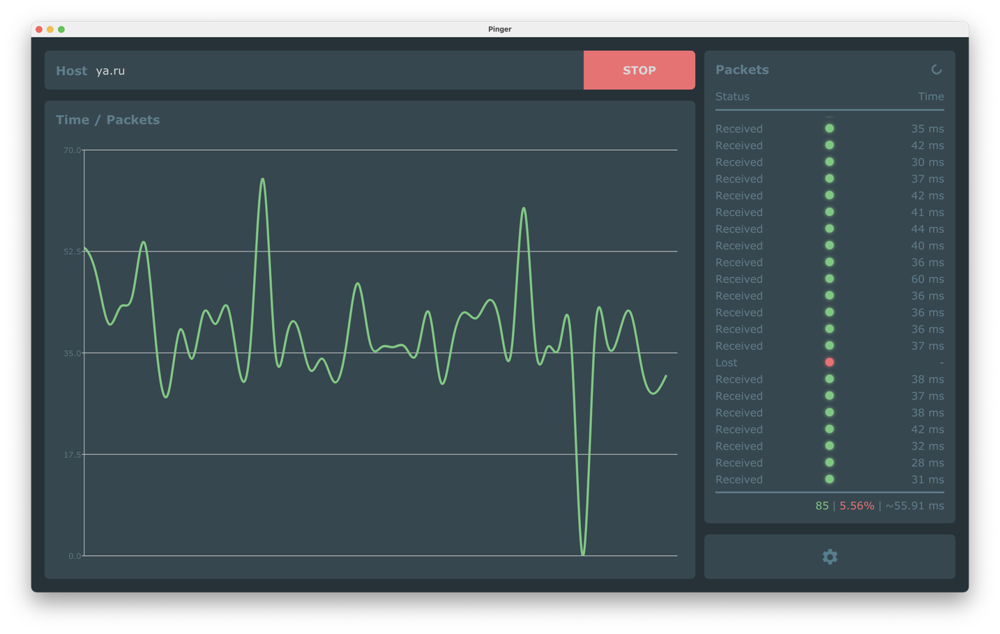

# Pinger

Network connection quality analyzer.

<!-- MarkdownTOC -->

- [How it works](#how-it-works)
- [Platforms support](#platforms-support)
- [3rd-party](#3rd-party)
- [FAQ](#faq)
    - [How to use checksums](#how-to-use-checksums)
    - [Why 7z for Mac OS distribution and not DMG](#why-7z-for-mac-os-distribution-and-not-dmg)
    - [Why still Qt 5 and not Qt 6](#why-still-qt-5-and-not-qt-6)

<!-- /MarkdownTOC -->



The application sends pinging requests to a selected host and tracks the following statistics:

- amount of requests sent, received and lost;
- requests time/latency/delay.

In the end it also does some analytics on the collected data.

## How it works

There are two modes of pinging the host:

- via system `ping` utility and ICMP requests. Most precise and reliable;
- via HTTP HEAD requests. Not as good, but might be the only option on systems without `ping`.

## Platforms support

The application is built with Qt and so it is cross-platform.

|  Platform | Status                                                  |
|----------:|:--------------------------------------------------------|
|    Mac OS | *works fine, pre-built binary available*                |
|   Windows | *works fine, pre-built binary available*                |
| GNU/Linux | *has certain issues, not distributing pre-built binary* |
|       iOS | *not checked*                                           |
|   Android | *not checked*                                           |
|         ? | *?*                                                     |

## 3rd-party

- built with [Qt](https://qt.io) ([GPLv3](https://www.gnu.org/licenses/gpl-3.0.en.html))
- [sounds](/src/sounds) are of unknown origin
- some of the [icons](/src/images) are of unknown origin

## FAQ

### How to use checksums

SHA256:

```
$ shasum -c ./pinger-v1.2.2-macos11.7z.sha256
./pinger-v1.2.2-macos11.7z: OK
```

PGP (*the key is [here](https://decovar.dev/about/retif-public.asc)*):

```
$ gpg --verify ./pinger-v1.2.2-macos11.7z.sig ./pinger-v1.2.2-macos11.7z
gpg: Signature made Fri Nov 12 20:24:37 2021 CET
gpg:                using RSA key E984212EC3E4CA2AFAA37E98713EE1F732D42E96
gpg: Good signature
```

### Why 7z for Mac OS distribution and not DMG

Because 7z archive is considerably smaller than a DMG image. So the question would be rather what's the point of using DMG.

### Why still Qt 5 and not Qt 6

Qt 6 still has a [number of issues](https://github.com/retifrav/pinger/issues/4), including degraded performance.
